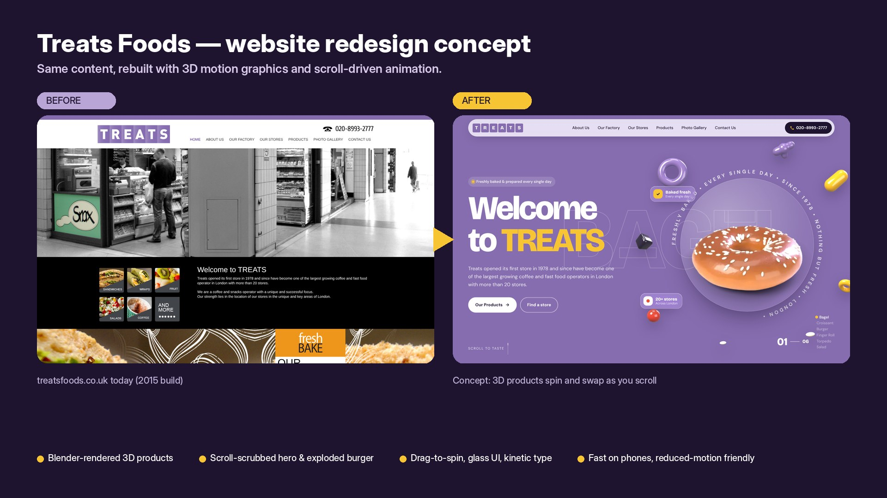

# Treats Foods: redesign pitch notes

Use these notes when you present the concept to Treats. Edit the wording to suit your own voice.

## What to send first

| File | Use it for |
|---|---|
| `preview/before-after.jpg` | The opening image. It shows the current site next to the concept. |
| `preview/before-after-mobile.jpg` | The portrait version for WhatsApp or Instagram DMs. |
| `preview/scroll-demo-mobile.mp4` | A 65 s phone recording. Most owners will watch it on their phone. |
| `preview/scroll-demo.mp4` | A 63 s desktop recording for email or a call. |
| The site itself | Run it locally (see README) and screen-share or present it live. |

## The short message

> Hi, I took Treats' current website and rebuilt it as a concept with the same content, so you can see what it could look like today. Your products are now 3D. They spin as you scroll, the burger comes apart layer by layer to show your factory, and all 13 stores can be filtered by area. It works on phones too. 1-minute video attached. Happy to walk you through it.

## Talking points

1. **It's your content.** Every fact, product, store address and phone number comes from the current site, so nothing is invented about the business. A few UI labels such as "Scroll to taste" are new. Three typos are fixed ("palette" → "palate", "wet" → "whet", "operator" → "operators").
2. **The current site dates from 2015.** The footer says ©2015. It has small product photos (89×89 px), a slideshow, and no real mobile layout.
3. **Your products are the hero.** The bagel, croissant, burger, finger roll, torpedo and salad are rendered in 3D. People can scroll through them or grab and spin them. The other 11 products get their own 3D section.
4. **The factory becomes a story.** The 16,000 sq ft factory and its three production areas are explained with an exploding burger, which beats a paragraph of text.
5. **Stores are easy to find.** All 13 locations can be filtered by area (Baker Street, South Kensington, Victoria, Harrow, Westminster), and every phone number and email is tap-to-call or tap-to-email.
6. **The brand is kept.** It uses their lilac (#866DAF, taken from the logo), their letter-tile logo (now also in 3D) and a nod to the "distinctive triangular logo" from their own copy.
7. **It's built to be practical.** It works on phones, loads lighter 3D on small screens, respects reduced-motion settings, and needs no build step, so it's cheap to host.

## Questions to expect

- **"Can you use our real photos?"** Yes. The gallery tiles are ready for real store photography, and the 3D products can be swapped for photos or re-rendered from reference.
- **"Can we update the store list ourselves?"** The stores are plain HTML today. A small CMS or a Google Sheet feed could be added.
- **"Is the content final?"** No, it's the current site's copy. A copy refresh (opening hours, current store list, menu highlights) would be a natural next step.
- **"Mobile?"** Show `scroll-demo-mobile.mp4`, or open the site on your phone.

## Things to check before presenting

- The store list and contact details are copied from the live site. Confirm they're still current.
- The concept uses the client's name and logo. Share it privately with Treats as a proposal. Don't publish it as if it were their official site.
- Try it on a mid-range phone before a live demo.
