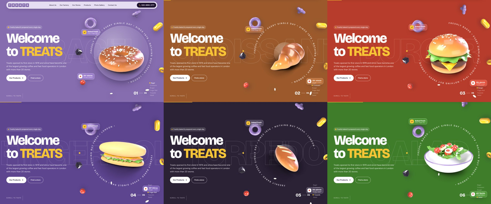

# Treats Foods: motion redesign concept

This is a pitch redesign of [treatsfoods.co.uk](https://www.treatsfoods.co.uk/). The copy, products, stores and contact details all come from the current site. The visuals and interaction are new. It is a static site with no build step.



## Run it

```bash
cd treats-redesign
npx http-server -p 8080 .   # or any static server, then open http://localhost:8080
```

Opening `index.html` straight from disk also works.

## 3D assets (Blender)

Every 3D element on the page is generated in code with Blender's Python API (`bpy`, Cycles) in [`3d/treats3d.py`](3d/treats3d.py). No hand modelling or stock assets are used.

- **Product turntables**: 40-frame 360° spins for the bagel, croissant, burger, finger roll, torpedo, salad and the Treats cup. The bread uses a procedural crust shader: a colour ramp from sides to top, noise mottling, ambient-occlusion darkening in the folds and a crumb bump. Seeds are scattered on the actual surface.
- **Exploded burger**: a 40-frame sequence where the layers fly apart while the camera orbits. It is scrubbed by scroll in the Factory section.
- **The full range**: 3D stills for the other 11 products (Baps, Ciabattas, Sandwich, Large K/bez, Pockets, Seekh Kebab, Wrap, Baguettes, Bloomer, Samosa, Mediterranean Roll).
- **SaaS-style motion elements**: glossy torus, pill, sphere, metaball blob, rounded cube, ring and sesame seed, which float with parallax in the hero. Also a 3D TREATS letter-tile logo.

Everything renders on a shadow catcher with a transparent background, so each object carries its own soft shadow onto any colour. [`3d/pack.py`](3d/pack.py) packs each sequence into a WebP sprite sheet (8 columns) plus a poster frame. `js/main.js` picks the frame per element: idle spin, faster on hover, and tied to scroll.

```bash
pip install bpy                     # Blender as a Python module (Python 3.11 wheel)
cd treats-redesign/3d
python3.11 treats3d.py bagel croissant burger finger torpedo salad cup explode logo \
  shape_torus shape_pill shape_sphere shape_cube shape_glass shape_blob shape_seed \
  range_baps range_ciabattas range_sandwich range_khubz range_pockets range_kebab \
  range_wrap range_baguettes range_bloomer range_samosa range_medroll
python3 pack.py work ../assets/3d    # sprite sheets + manifest.json
```

Use `ONE=1` to render a single test frame, and `SAMPLES=n` to trade quality for speed. On 4 CPU cores a turntable frame takes about 6 s.

## What's on the page

| Section | Motion |
|---|---|
| Loader | The six lilac letter tiles from the Treats logo drop in, count to 100%, then wipe away. |
| **Hero** | Pinned while you scroll. The 3D product in the centre turns a full 360° as you scroll, then rolls out as the next one rolls in: Bagel, Croissant, Burger, Finger Roll, Torpedo, Salad. The background colour, the giant outline word, the counter and the list all change with it. Glossy 3D shapes and glass UI chips float with parallax around a rotating text ring. It snaps to each product. |
| Marquee | "Our outlets are open when our customers want them to be" loops forever. It speeds up and skews with scroll speed. |
| About | The statement fills in word by word as you scroll. Stats count up (1978, 20+, 16,000 ft², 3). The Future Vision card shows the 100 / 200 / 2,000 ft² unit sizes as squares that grow in. |
| Products | Pinned horizontal scroll through the six hero products. The 3D models turn as the track moves and spin faster on hover. On mobile it becomes a native swipe scroller. |
| Full range | A sticky 3D stage. Each of the other 11 products rolls in as its name scrolls past, and the stage tilts with the mouse. On mobile each row gets a 3D thumbnail. |
| Sandwich bars / Food | Triangles echo the "distinctive triangular logo" and rotate on scroll. A 3D Treats cup turns with the scroll and has animated steam. The dish chips pop in. |
| **Factory** | Pinned 3D "exploded burger". Scrolling scrubs the Blender sequence, so the layers fly apart while the camera orbits. The factory's production areas (Bakery, Sandwich room / salad, Fryer room, UK supply) light up one by one. |
| Hygiene | The four QC points slide in and their tick marks draw on. |
| Stores | A stylised route line draws on scroll. Station chips filter the 13 store cards. |
| Gallery | Two tilted rows of tiles slide in opposite directions. The tiles carry the gallery's location names. |
| Contact | The phone number rises in letter by letter. Cards for Head Office, Recruitment and Customer Services. |

The whole page also has Lenis smooth scrolling, a cursor with labels, magnetic buttons, a scroll progress bar, a nav that hides as you scroll down and highlights the current section, and a full-screen mobile menu.

## Notes for the pitch

- **Brand colour**: lilac `#866DAF`, sampled from the current logo. The original copy mentions "friendly lilac interiors", so the palette builds on that.
- **3D instead of photos**: the current site's product photos are 89×89 px, too small to reuse, so every product is a Blender render. Real photography can go into the gallery tiles once the client supplies it.
- **Copy**: kept as on the live site. Only typos are fixed ("palette" → "palate", "wet their appetites" → "whet their appetites", "operator" → "operators"). The ingredient labels and small UI captions (e.g. "Scroll to taste") are new.
- **Accessibility**: `prefers-reduced-motion` turns off smooth scroll, pins and the loader and shows all content. Without JS the page still reads top to bottom. The custom cursor is off on touch devices.
- **Tested**: Chromium at 1440×900 and 390×844, with no console errors and no horizontal overflow.

## Files

```
index.html        markup
css/style.css     design tokens, layout, responsive rules
js/main.js        all motion (GSAP 3.12 + ScrollTrigger, Lenis 1.1) + 3D sprite engine
3d/               Blender scene builder (treats3d.py) and sprite packer (pack.py)
assets/3d/        rendered sprite sheets, posters, stills (WebP) + manifest.json
vendor/           GSAP, ScrollTrigger, Lenis (vendored, no CDN needed)
preview/          screenshots for the pitch
```
